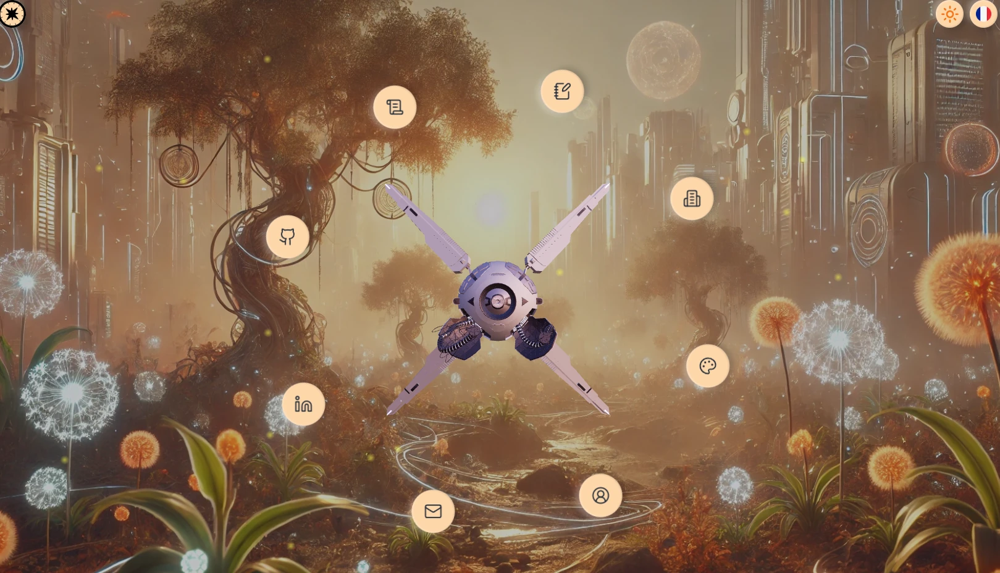

# My 3D Portfolio

## Introduction

Welcome to the second edition of my interactive portfolio, designed to reflect the evolution of my skills and professional journey. This updated project incorporates modern technologies and 3D animations to provide an even more immersive and engaging user experience.

## Portfolio Sections

### Career

Explore my updated professional journey, with details on my recent experiences and newly acquired skills. This section highlights my continuous development and contributions to various projects.

### Projects

Discover an updated selection of my most recent and significant projects. Each project is accompanied by a detailed description, the technologies used, and the challenges overcome, illustrating my innovative approach and problem-solving capabilities.

### About

Learn more about me, my renewed passions, and what drives me in the field of development. This section offers insight into my personality and current professional goals.

### Contact

I am always open to new opportunities and collaborations. Use the contact form to easily reach out to me for any questions or proposals.

## Technologies Used

- **Vite/React**: A fast and modern build tool for developing robust and stable web applications.
- **Three.js**: A JavaScript library for creating and displaying 3D graphics in the browser.
- **Tailwind CSS**: A utility-first CSS framework for rapid and responsive design.
- **Framer Motion**: A library for smooth and dynamic animations.
- **Zustand**: Simple and scalable state management for React.
- **React Hook Form**: Form management with built-in validation.
- **Zod**: Schema validation for TypeScript and JavaScript.
- **i18n**: Internationalization to make content accessible in multiple languages.
- **EmailJS**: A service to send emails directly from the browser.
- **Responsiveness**: Adaptive design for an optimal user experience on all devices.

## Key Features

- **Light or Dark Mode**: Choose between a light or dark theme for a visual experience tailored to your preferences.
- **Internationalization (i18n)**: Access content in multiple languages with SEO-friendly URL updates for a global reach.
- **3D Animations**: Enjoy an enriched visual experience with interactive 3D elements.
- **Halftone Card Carousel**: Display projects in an engaging and visually appealing manner using the Halftone Card Carousel, enhancing user interaction.
- **Contact Form**: A simple and effective way to reach out to me for any inquiries.
